# daru - Data Analysis in RUby

[](http://badge.fury.io/rb/daru)
[](https://travis-ci.org/SciRuby/daru)
[](https://gitter.im/v0dro/daru?utm_source=badge&utm_medium=badge&utm_campaign=pr-badge)
[](https://www.codetriage.com/sciruby/daru)

## Introduction

daru (Data Analysis in RUby) is a library for storage, analysis, manipulation and visualization of data in Ruby.

daru makes it easy and intuitive to process data predominantly through 2 data structures:
`Daru::DataFrame` and `Daru::Vector`. Written in pure Ruby works with all ruby implementations.
Tested with MRI 2.5.1 and 2.7.1.

## daru plugin gems

- **[daru-view](https://github.com/SciRuby/daru-view)**

daru-view is for easy and interactive plotting in web application & IRuby 
notebook. It can work in any Ruby web application frameworks like Rails, Sinatra, Nanoc and hopefully in others too.

Articles/Blogs, that summarize powerful features of daru-view:

* [GSoC 2017 daru-view](http://sciruby.com/blog/2017/09/01/gsoc-2017-data-visualization-using-daru-view/)
* [GSoC 2018 Progress Report](https://github.com/SciRuby/daru-view/wiki/GSoC-2018---Progress-Report)
* [HighCharts Official blog post regarding daru-view](https://www.highcharts.com/blog/post/i-am-ruby-developer-how-can-i-use-highcharts/)

- **[daru-io](https://github.com/SciRuby/daru-io)**

This gem extends support for many Import and Export methods of `Daru::DataFrame`. This gem is intended to help Rubyists who are into Data Analysis or Web Development, by serving as a general purpose conversion library that takes input in one format (say, JSON) and converts it another format (say, Avro) while also making it incredibly easy to getting started on analyzing data with daru. One can read more in [SciRuby/blog/daru-io](http://sciruby.com/blog/2017/08/29/gsoc-2017-support-to-import-export-of-more-formats/).


## Features

* Data structures:
    - Vector - A basic 1-D vector.
    - DataFrame - A 2-D spreadsheet-like structure for manipulating and storing data sets. This is daru's primary data structure.
* Compatible with [IRuby notebook](https://github.com/SciRuby/iruby), [statsample](https://github.com/SciRuby/statsample), [statsample-glm](https://github.com/SciRuby/statsample-glm) and [statsample-timeseries](https://github.com/SciRuby/statsample-timeseries).
* Support for time series.
* Singly and hierarchically indexed data structures.
* Flexible and intuitive API for manipulation and analysis of data.
* Easy plotting, statistics and arithmetic.
* Plentiful iterators.
* Optional speed and space optimization on MRI with [NMatrix](https://github.com/SciRuby/nmatrix) and GSL.
* Easy splitting, aggregation and grouping of data.
* Quickly reducing data with pivot tables for quick data summary.
* Import and export data from and to Excel, CSV, SQL Databases, ActiveRecord and plain text files.

## Installation

```console
$ gem install daru
```

## Notebooks

#### Notebooks on most use cases

* [Overview of most daru functions](http://nbviewer.ipython.org/github/SciRuby/sciruby-notebooks/blob/master/Data%20Analysis/Daru%20Demo.ipynb)
* [Basic Creation of Vectors and DataFrame](http://nbviewer.ipython.org/github/SciRuby/sciruby-notebooks/blob/master/Data%20Analysis/Creation%20of%20Vector%20and%20DataFrame.ipynb)
* [Detailed Usage of Daru::Vector](http://nbviewer.ipython.org/github/SciRuby/sciruby-notebooks/blob/master/Data%20Analysis/Usage%20of%20Vector.ipynb)
* [Detailed Usage of Daru::DataFrame](http://nbviewer.ipython.org/github/SciRuby/sciruby-notebooks/blob/master/Data%20Analysis/Usage%20of%20DataFrame.ipynb)
* [Searching and combining data in daru](http://nbviewer.ipython.org/github/SciRuby/sciruby-notebooks/blob/master/Data%20Analysis/Searching%20and%20Combining%20Data.ipynb)
* [Grouping, Splitting and Pivoting Data](http://nbviewer.ipython.org/github/SciRuby/sciruby-notebooks/blob/master/Data%20Analysis/Grouping%2C%20Splitting%20and%20Pivoting.ipynb)
* [Usage of Categorical Data](http://nbviewer.jupyter.org/github/SciRuby/sciruby-notebooks/blob/master/Data%20Analysis/Categorical%20Data/Categorical%20Data.ipynb)

#### Visualization
* [Visualizing Data With Daru::DataFrame](http://nbviewer.ipython.org/github/SciRuby/sciruby-notebooks/blob/master/Visualization/Visualizing%20data%20with%20daru%20DataFrame.ipynb)
* [Plotting using Nyaplot](http://nbviewer.jupyter.org/github/SciRuby/sciruby-notebooks/blob/master/Data%20Analysis/Plotting/Visualization.ipynb)
* [Plotting using GnuplotRB](http://nbviewer.jupyter.org/github/SciRuby/sciruby-notebooks/blob/master/Data%20Analysis/Plotting/Gnuplotrb.ipynb)
* [Vector plotting with Gruff](http://nbviewer.jupyter.org/github/SciRuby/sciruby-notebooks/blob/master/Data%20Analysis/Plotting/Gruff%20Vector.ipynb)
* [DataFrame plotting with Gruff](http://nbviewer.jupyter.org/github/SciRuby/sciruby-notebooks/blob/master/Data%20Analysis/Plotting/Gruff%20DataFrame.ipynb)

#### Notebooks on Time series

* [Basic Time Series](http://nbviewer.ipython.org/github/SciRuby/sciruby-notebooks/blob/master/Data%20Analysis/Basic%20Time%20Series.ipynb)
* [Time Series Analysis and Plotting](http://nbviewer.ipython.org/github/SciRuby/sciruby-notebooks/blob/master/Data%20Analysis/Time%20Series%20Functions.ipynb)

#### Notebooks on Indexing
* [Indexing in Vector](http://nbviewer.jupyter.org/github/SciRuby/sciruby-notebooks/blob/master/Data%20Analysis/Categorical%20Data/Indexing%20in%20Vector.ipynb)
* [Indexing in DataFrame](http://nbviewer.jupyter.org/github/SciRuby/sciruby-notebooks/blob/master/Data%20Analysis/Categorical%20Data/Indexing%20in%20DataFrame.ipynb)

### Case Studies

* [Logistic Regression Analysis with daru and statsample-glm](http://nbviewer.ipython.org/github/SciRuby/sciruby-notebooks/blob/master/Data%20Analysis/Logistic%20Regression%20with%20daru%20and%20statsample-glm.ipynb)
* [Finding and Plotting most heard artists from a Last.fm dataset](http://nbviewer.ipython.org/github/SciRuby/sciruby-notebooks/blob/master/Data%20Analysis/Finding%20and%20plotting%20the%20most%20heard%20artists%20on%20last%20fm.ipynb)
* [Analyzing baby names with daru](http://nbviewer.ipython.org/github/SciRuby/sciruby-notebooks/blob/master/Data%20Analysis/Analyzing%20baby%20names/Use%20Case%20-%20Daru%20for%20analyzing%20baby%20names%20data.ipynb)
* [Example usage of Categorical Data](http://nbviewer.jupyter.org/github/SciRuby/sciruby-notebooks/blob/master/Data%20Analysis/Categorical%20Data/examples/%5BExample%5D%20Categorical%20Data.ipynb)
* [Example usage of Categorical Index](http://nbviewer.jupyter.org/github/SciRuby/sciruby-notebooks/blob/master/Data%20Analysis/Categorical%20Data/examples/%5BExample%5D%20Categorical%20Index.ipynb)

## Blog Posts

* [Data Analysis in RUby: Basic data manipulation and plotting](http://v0dro.github.io/blog/2014/11/25/data-analysis-in-ruby-basic-data-manipulation-and-plotting/)
* [Data Analysis in RUby: Splitting, sorting, aggregating data and data types](http://v0dro.github.io/blog/2015/02/24/data-analysis-in-ruby-part-2/)
* [Finding and Combining data in daru](http://v0dro.github.io/blog/2015/08/03/finding-and-combining-data-in-daru/)
* [Introduction to analyzing datasets with daru library](http://gafur.me/2018/02/05/analysing-datasets-with-daru-library.html)

### Time series

* [Analysis of Time Series in daru](http://v0dro.github.io/blog/2015/07/31/analysis-of-time-series-in-daru/)
* [Date Offsets in Daru](http://v0dro.github.io/blog/2015/07/27/date-offsets-in-daru/)

### Categorical Data

* [Categorical Index](http://lokeshh.github.io/gsoc2016/blog/2016/06/14/categorical-index/)
* [Categorical Data](http://lokeshh.github.io/gsoc2016/blog/2016/06/21/categorical-data/)
* [Visualization with Categorical Data](http://lokeshh.github.io/gsoc2016/blog/2016/07/02/visualization/)

## Basic Usage

daru exposes two major data structures: `DataFrame` and `Vector`. The Vector is a basic 1-D structure corresponding to a labelled Array, while the `DataFrame` - daru's primary data structure - is 2-D spreadsheet-like structure for manipulating and storing data sets.

Basic DataFrame intitialization.

``` ruby
data_frame = Daru::DataFrame.new(
  {
    'Beer' => ['Kingfisher', 'Snow', 'Bud Light', 'Tiger Beer', 'Budweiser'],
    'Gallons sold' => [500, 400, 450, 200, 250]
  },
  index: ['India', 'China', 'USA', 'Malaysia', 'Canada']
)
data_frame
```
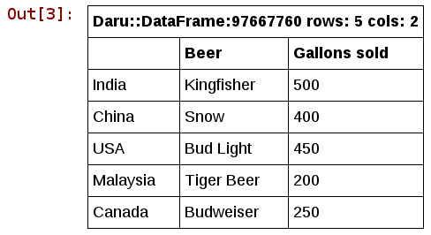


Load data from CSV files.
``` ruby
df = Daru::DataFrame.from_csv('TradeoffData.csv')
```
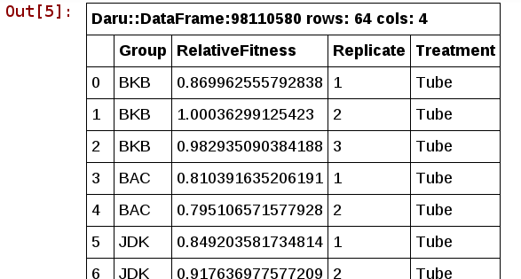

*Basic Data Manipulation*

Selecting rows.
``` ruby
data_frame.row['USA']
```
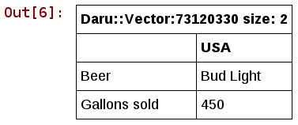

Selecting columns.
``` ruby
data_frame['Beer']
```
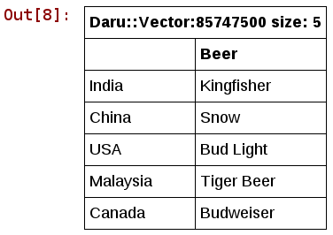

A range of rows.
``` ruby
data_frame.row['India'..'USA']
```
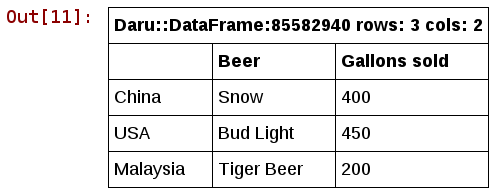

The first 2 rows.
``` ruby
data_frame.first(2)
```
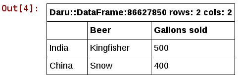

The last 2 rows.
``` ruby
data_frame.last(2)
```
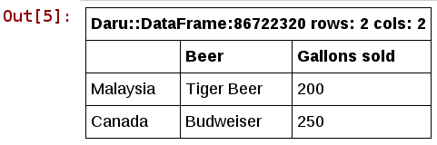

Adding a new column.
``` ruby
data_frame['Gallons produced'] = [550, 500, 600, 210, 240]
```
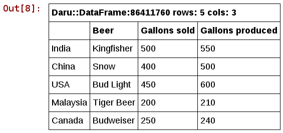

Creating a new column based on data in other columns.
``` ruby
data_frame['Demand supply gap'] = data_frame['Gallons produced'] - data_frame['Gallons sold']
```
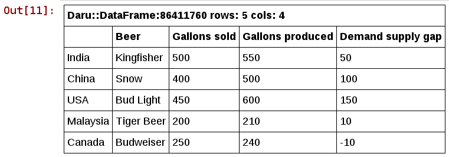

*Condition based selection*

Selecting countries based on the number of gallons sold in each. We use a syntax similar to that defined by [Arel](https://github.com/rails/arel), i.e. by using the `where` clause.
``` ruby
data_frame.where(data_frame['Gallons sold'].lt(300))
```
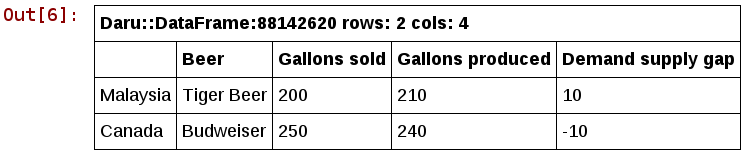

You can pass a combination of boolean operations into the `#where` method and it should work fine:
``` ruby
data_frame.where(
  data_frame['Beer']
  .in(['Snow', 'Kingfisher','Tiger Beer'])
  .and(
    data_frame['Gallons produced'].gt(520).or(data_frame['Gallons produced'].lt(250))
  )
)
```
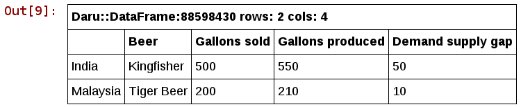

*Plotting*

Daru supports plotting of interactive graphs with [nyaplot](https://github.com/domitry/nyaplot). You can easily create a plot with the `#plot` method. Here we plot the gallons sold on the Y axis and name of the brand on the X axis in a bar graph.
``` ruby
data_frame.plot type: :bar, x: 'Beer', y: 'Gallons sold' do |plot, diagram|
  plot.x_label "Beer"
  plot.y_label "Gallons Sold"
  plot.yrange [0,600]
  plot.width 500
  plot.height 400
end
```
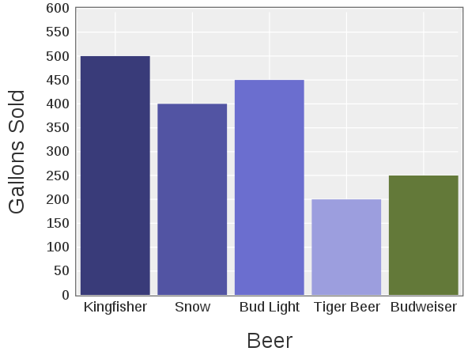

In addition to nyaplot, daru also supports plotting out of the box with [gnuplotrb](https://github.com/SciRuby/gnuplotrb).

## Documentation

Docs can be found [here](http://www.rubydoc.info/gems/daru).

## Contributing

Pick a feature from the Roadmap or the issue tracker or think of your own and send me a Pull Request!

For details see [CONTRIBUTING](https://github.com/SciRuby/daru/blob/master/CONTRIBUTING.md).

## Acknowledgements

* Google and the Ruby Science Foundation for the Google Summer of Code 2016 grant for speed enhancements and implementation of support for categorical data. Special thanks to [@lokeshh](https://github.com/lokeshh), [@zverok](https://github.com/zverok) and [@agisga](https://github.com/agisga) for their efforts.
* Google and the Ruby Science Foundation for the Google Summer of Code 2015 grant for further developing daru and integrating it with other ruby gems.
* Thank you [last.fm](http://www.last.fm/) for making user data accessible to the public.

Copyright (c) 2015, Sameer Deshmukh
All rights reserved
